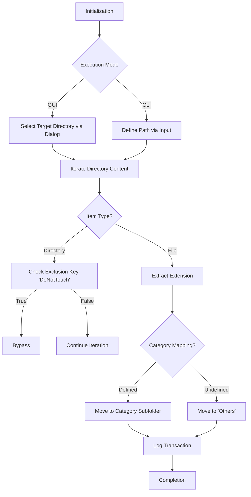

# FolderOrganizer

[](https://www.python.org/)

FolderOrganizer is a Python-based utility designed for automated file management and directory structuring. It provides a systematic approach to sorting files into categorized subdirectories based on their extensions, along with a utility for generating dummy datasets for testing purposes.

---

## Interface Overview


---

## System Components

The project is structured into three primary modules, each serving a specific role in the file management workflow:

### 1. File Organizer (organizer.py)
The core logic responsible for scanning directories and relocating files based on extension-to-category mapping.
* **Automated Categorization**: Supports sorting into 13 distinct categories including Images, Documents, Videos, and Archives.
* **Protected Directories**: Automatically bypasses sensitive folders such as "DoNotTouch".
* **Conflict Management**: Implements indexed naming for duplicate files to prevent data loss.
* **Stand-alone Execution**: Optimized for both manual CLI execution and module integration.

### 2. Dummy Data Generator (dummyGenerator.py)
A utility for creating comprehensive test datasets with realistic file structures.
* **Multi-Format Coverage**: Generates placeholder files for over 100 extensions.
* **Realistic Simulation**: Uses randomized naming and type-specific placeholder content.
* **Test Environment Preparation**: Designed for verifying backup systems and storage scripts.

### 3. Graphical Interface (gui.py)
A Tkinter-based frontend providing a streamlined user experience for the organization engine.
* **Dir-Picker Integration**: Native OS file dialogs for directory selection.
* **Execution Feedback**: Standardized logging for real-time progress monitoring.

---

## Technical Workflow



---

## Supported File Categories

| Category | Extensions |
| :--- | :--- |
| **Images** | .png, .jpg, .webp, .svg, .psd, .ai, .tiff, .raw |
| **Documents** | .pdf, .docx, .txt, .md, .epub, .xlsx, .pptx |
| **Videos** | .mp4, .mkv, .avi, .mov, .flv, .webm |
| **Audio** | .mp3, .wav, .flac, .aac, .m4a, .ogg |
| **Archives** | .zip, .rar, .7z, .tar, .iso, .dmg |
| **Scripts** | .py, .js, .html, .css, .cpp, .sh, .sql, .java |
| **Executables**| .exe, .msi, .apk, .bat, .deb, .bin |
| **Spreadsheets**| .xlsx, .csv, .ods, .xls, .xlsm |

> [!NOTE]
> Extension mapping can be extended by modifying the `FILE_CATEGORIES` dictionary within `organizer.py`.

---

## Installation and Usage

### Portable Version (Windows)
1. Locate `FolderOrganizer.exe` in the project root.
2. Launch the application.
3. Input the target path when prompted to initiate organization.

### Development Environment (Python)
Requirements: Python 3.6 or higher.

```bash
# Clone the repository
git clone https://github.com/letsconfuse/FolderOrganizer.git

# Launch the Graphical Interface
python gui.py

# Launch the Data Generator
python dummyGenerator.py
```

---

## Use Cases
* **QA & Testing**: Efficient generation of mock data for automation suites.
* **Disk Optimization**: Automating the maintenance of high-traffic folders (Downloads/Desktop).
* **Workflow Automation**: Standardizing project structures for development teams.

---

## License
Distributed under the MIT License. Refer to the `LICENSE` file for full terms.

## Author
**LetsConfuse** - [GitHub Profile](https://github.com/letsconfuse)
